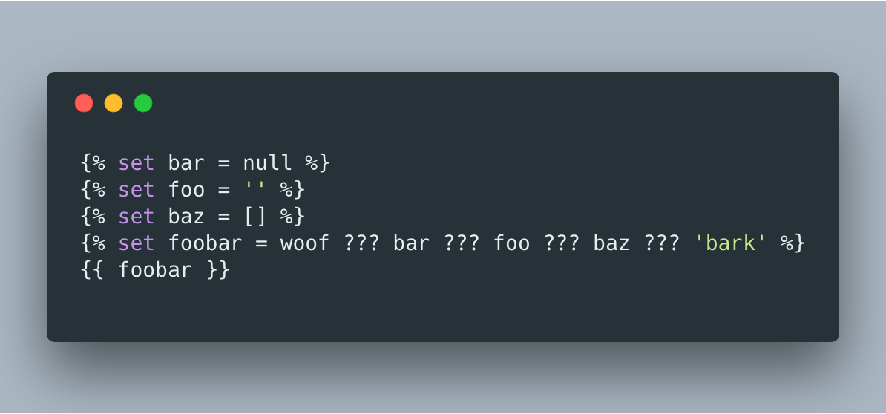

[](https://scrutinizer-ci.com/g/nystudio107/craft-emptycoalesce/?branch=v1) [](https://scrutinizer-ci.com/g/nystudio107/craft-emptycoalesce/?branch=v1) [](https://scrutinizer-ci.com/g/nystudio107/craft-emptycoalesce/build-status/v1) [](https://scrutinizer-ci.com/code-intelligence)

# Empty Coalesce plugin for Craft CMS 3.x

Empty Coalesce adds the ??? operator to Twig that will return the first thing that is defined, not null, and not empty.


## Requirements

This plugin requires Craft CMS 3.0.0 or later.

## Installation

To install the plugin, follow these instructions.

1. Open your terminal and go to your Craft project:

        cd /path/to/project

2. Then tell Composer to load the plugin:

        composer require nystudio107/craft-emptycoalesce

3. In the Control Panel, go to Settings → Plugins and click the “Install” button for Empty Coalesce.

You can also install Empty Coalesce via the **Plugin Store** in the Craft AdminCP.

## Empty Coalesce Overview

Empty Coalesce adds the `???` operator to Twig that will return the first thing that is defined, not null, and not empty. This is particularly useful when you're dealing with a number of fallback/default values that may or may not exist, and may or may not be empty.

The `???` Empty Coalescing operator is similar to the `??` [null coalescing operator](https://nystudio107.com/blog/handling-errors-gracefully-in-craft-cms#coalescing-the-night-away), but also ignores empty strings (`""`) and empty arrays (`[]`) as well.




It's pretty common in Twig that you might want to do something like use an `entry.description` if it exists, and if not, use a `category.description` if it exists, and then finally fall back on using some default `global.description`.

The problem is that to [code defensively](https://nystudio107.com/blog/handling-errors-gracefully-in-craft-cms#defensive-coding-in-twig), you want to make sure that all of these things are defined, not null, and also have a value. So you end up with something like:

```twig

    

    

    

```

This gets quite verbose and quite tiresome quickly. There are other ways you can do something similar, such as using using the `?:` [ternary operator](https://twig.symfony.com/doc/2.x/templates.html#other-operators) and the [default filter](https://twig.symfony.com/doc/2.x/filters/default.html), but this too gets a bit unwieldy.

You can use the [null coalescing operator](https://nystudio107.com/blog/handling-errors-gracefully-in-craft-cms#coalescing-the-night-away), which picks the first thing that is defined and not null:

```twig

```

But the problem here is it'll _just_ pick the first thing that is defined and not `null`. So if `entry.description` is an empty string, it'll use that, which is rarely what you want.

Enter the Empty Coalescing operator, and it becomes:

```twig

```

Now the first thing that is defined, not null, _and_ not empty will be what `description` is set to.

Nice. Simple. Readable. And most importantly, likely the result you're expecting.

## Configuring Empty Coalesce

There's nothing to configure.

## Using Empty Coalesce

Using the Empty Coalescing operator is simple; you can chain together as many variables as you like:

```twig

```
The first thing that is defined, not null, and not empty will be what `choise` is set to. If _nothing_ meets that criteria, then `choice` is set to `null`. For example:

```twig




{{ foobar }}
```
This will output:
```
bark
```

...because:
- `woof` is undefined
- `foo` is an empty string
- `baz` is an empty array

Happy templating!

## Empty Coalesce Roadmap

Some things to do, and ideas for potential features:

* Submit a PR to the Twig project to get it into core

Brought to you by [nystudio107](https://nystudio107.com/)
